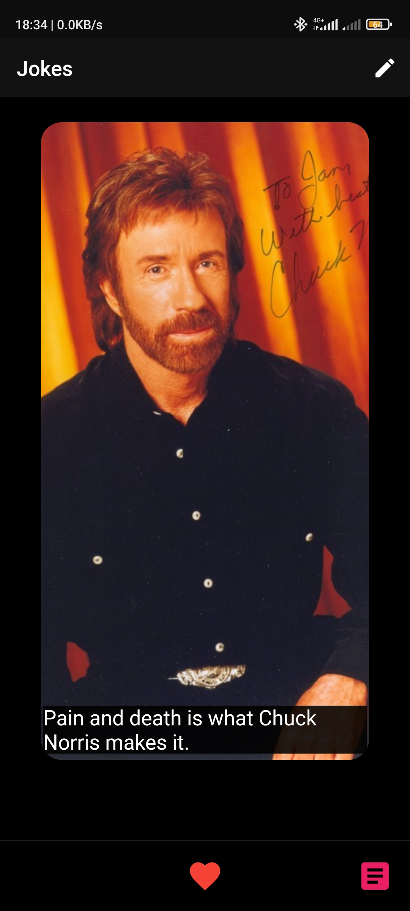
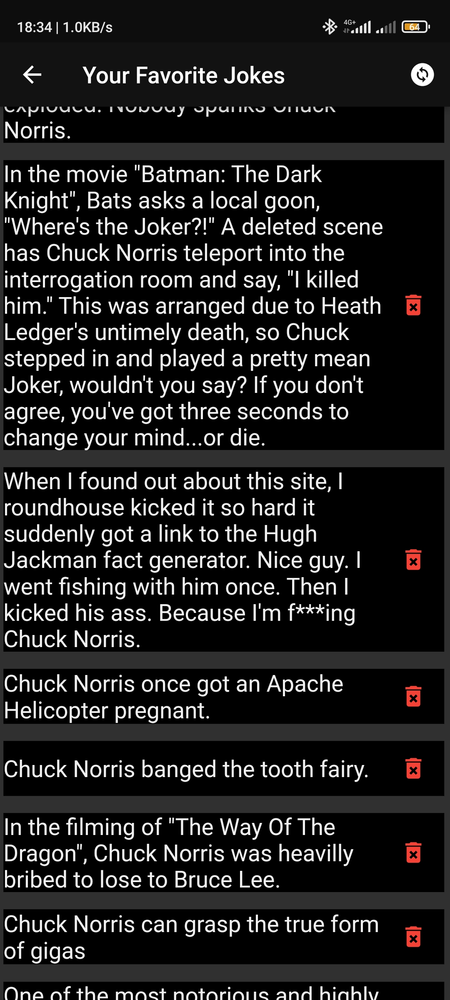
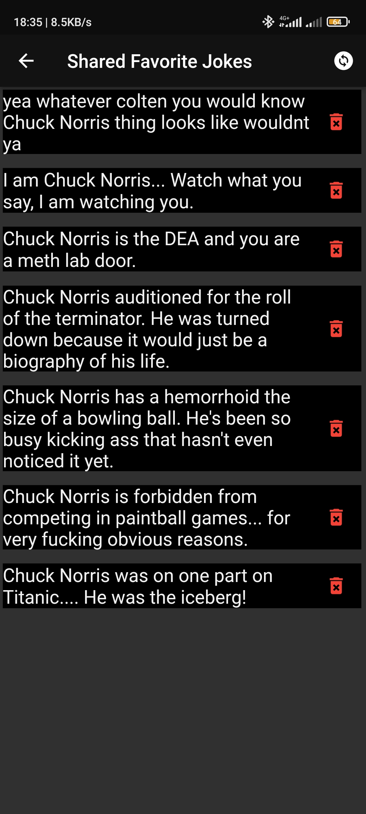
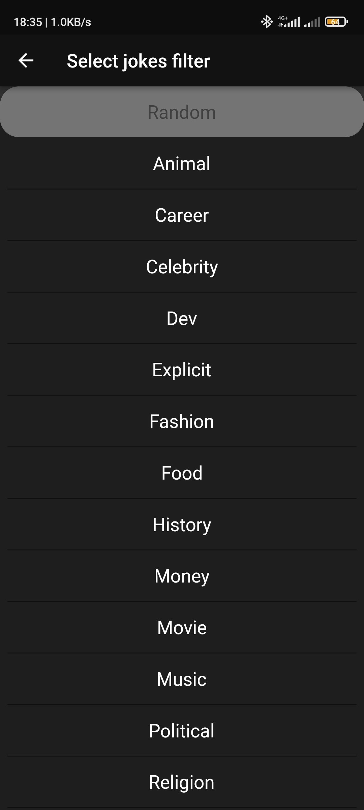

# chinder_for_jokes

**Chinder for Jokes**
Application for Android and IOS, which is showing jokes about Chuck Norris. Each joke is located on 
special card(like tinder) with image. You can add favorite jokes to the special page. Each joke can
be deleted from favorite page. Moreover, 

## Features of App

 - The best jokes about Chuck Norris
 - Beautiful images for each joke
 - Favorite page for your favorite jokes
 - Like button for adding current joke to the favorite page
 - Jokes' filter
 - Shared favorite list for everyone

## Tools which are used for development

I used [swiping_card_deck for](https://github.com/jushutch/swiping_card_deck) for animation and 
comfortable coding. Moreover, I used FireBase for Shared favorite list and crash logs, also Hive for
storing data locally.

## Link to the .apk

[Google drive link](https://drive.google.com/file/d/1tk9lnal27juiShPm5zXn5ZzsYjeUh77E/view?usp=sharing)

## Screenshots

